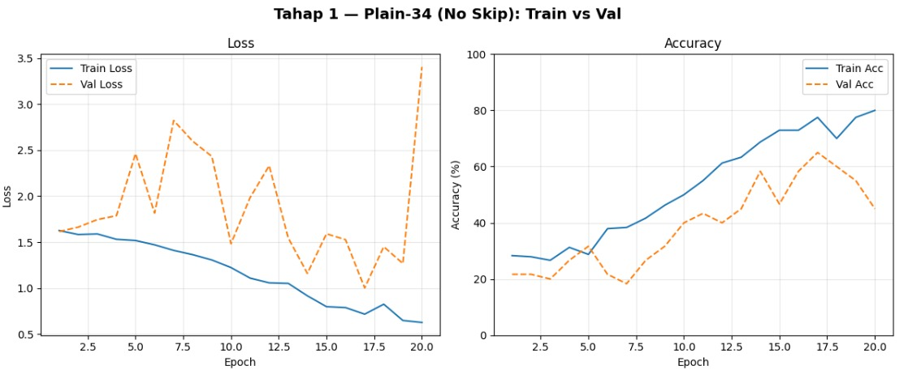
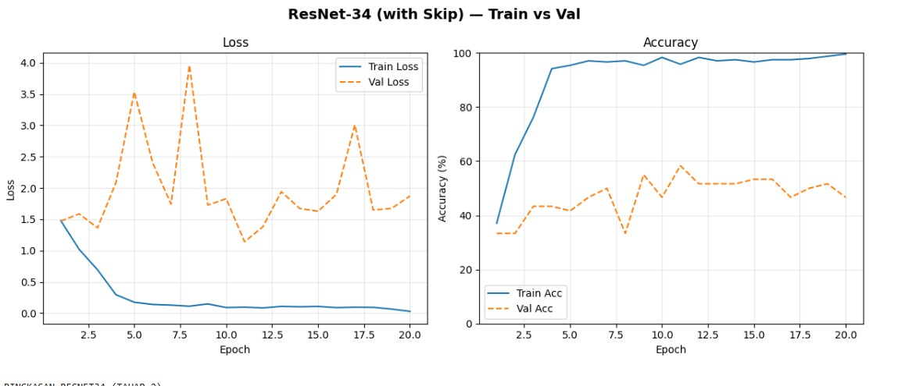

# Perbandingan Performa antara Plain-34 dan ResNet-34 (Deep Learning RA)

## **Anggota Kelompok**

| **Nama**                    | **NIM**   |
| --------------------------- | --------- | 
| Alfajar                 | 122140122 |
| Ikhsannudin Lathief     | 122140137 |
| Shintya Ayu Wardani     | 122140138 | 
---

Berikut link source code : <a href="https://colab.research.google.com/drive/17uu26xLrM-hf8yF04S_icx59O8YLP-5k?usp=sharing">Collab

## **Perbandingan Metrik**

Berikut merupakan tabel perbandingan antara Plain-34 dan ResNet-34

### Tahap 1

| **No.** | **Perbandingan Metrik**         | **Plain-34**  | 
|-----|-------------------------------------|---------------|
| 1   | `training accuracy`                 |     80%       |
| 2   | `validation accuracy`               |     45%       |
| 3   | `training loss`                     |     0.63      |
| 4   | `validation loss`                   |     3.40      |
---

### Tahap 2

| **No.** | **Perbandingan Metrik**         | **ResNet-34** |
|-----|-------------------------------------|---------------|
| 1   | `training accuracy`                 |     99.58%    |
| 2   | `validation accuracy`               |     46.67%    |
| 3   | `training loss`                     |     0.03      |
| 4   | `validation loss`                   |     1.87      |
---

## **Grafik Sederhana**

## **Analisis**

Pada grafik Plain-34 (No Skip) terlihat bahwa training loss turun secara konsisten sampai akhir epoch, terdapat peningkatan training accuracy yang cukup stabil. Namun, validation loss justru berfluktuasi tinggi dan meningkat di akhir epoch, sementara validation accuracy naik tetapi masih jauh di bawah training accuracy. Hal ini karena adanya indikasi overfitting, di mana model mampu belajar dengan baik pada data latih tetapi kurang mampu melakukan generalisasi pada data validasi.

Sebaliknya, pada ResNet-34 (With Skip), training loss turun sangat cepat dan hampir mendekati nol, dengan training accuracy yang hampir mencapai 100% sejak epoch awal. Validation accuracy juga relatif lebih stabil dengan capaian yang lebih baik dibanding Plain-34, meskipun masih terlihat adanya fluktuasi pada validation loss. Hal ini menandakan bahwa residual connection berhasil membantu mempercepat konvergensi model dan membuat proses training lebih stabil.

Dari hasil ini dapat disimpulkan bahwa ResNet-34 memiliki performa yang jauh lebih unggul dibanding Plain-34. Residual connection terbukti efektif mengatasi permasalahan vanishing gradient, mempercepat proses belajar, serta meningkatkan kemampuan generalisasi. Walaupun masih terdapat gap antara training dan validation performance, ResNet-34 tetap lebih efisien dan stabil dibanding arsitektur Plain-34.

## **Konfigurasi Hyperparameter**

| **No.** | **Hyperparameter** | **Plain-34**      | **ResNet-34**    |
|-----|------------------------|-------------------|------------------|
| 1   | `epoch`                |       20          |       20         |
| 2   | `optimizer`            |      AdamW        |      AdamW       |
| 3   | `loss function`        | Cross-entropy loss|Cross-entropy loss|
| 4   | `learning rate`        |       0.001       |      0.001       |
---
